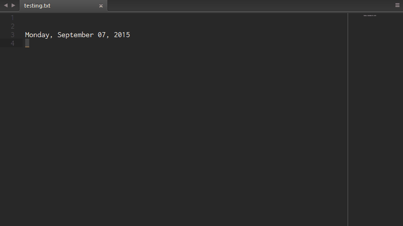
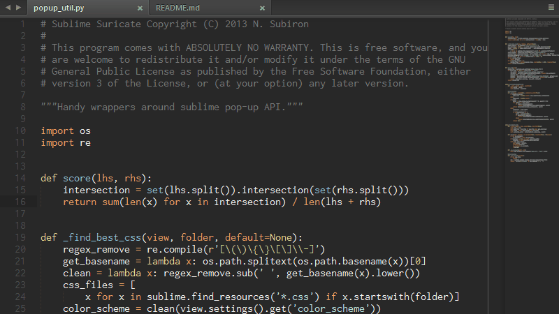
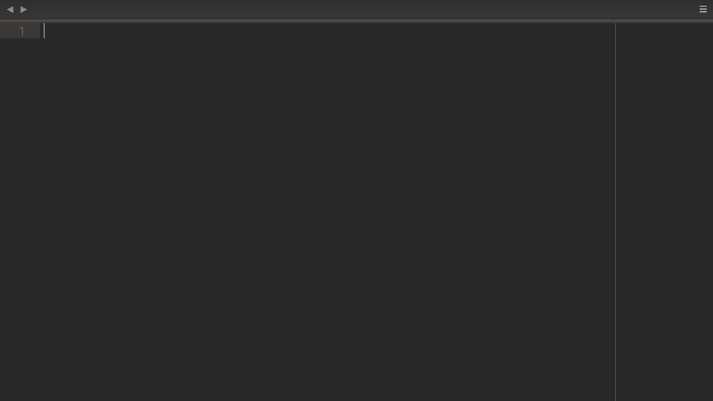

Sublime Text's Suricate
=======================

***Command framework for Sublime Text 3.***

Sublime Text's Suricate provides an easier way to implement simple commands to
extend Sublime Text functionality without the need to create a new plugin. It
unifies the concept of command, key-binding and menu entry in a single one-place
definition. Sublime Suricate loads a single plugin parses and handles the whole
collection of commands, enabling and disabling commands based on a simple set of
flags and settings. The commands are organized in _Suricate Profiles_, when a
profile is active the commands in it are parsed and the necessary Sublime Text
configuration files are generated. The Suricate allows commands to call static
Python methods directly, implementing a new command is as easy as writing one
Python function. The Suricate also comes with a library of command utils and
convenient wrappers around Sublime Text's API, as well as a collection of handy
commands.

  * [Extended API](https://sublime-suricate.readthedocs.org/en/latest/api-reference/) with convenient functions that simplify common plugin tasks.
  * Straightforward calls to Python functions without the need to write new plugin classes.
  * A single plugin is loaded to handle the whole collection of commands, library modules are loaded only when needed.
  * Commands are organized in _Suricate Profiles_, easily activate or deactivate sets of commands adding or removing profiles.
  * Shipped with a handy [collection of commands](#shipped-profiles).

Take a look at the
[Quick Guide](https://sublime-suricate.readthedocs.org/en/latest/quick-guide/).

Shipped Profiles
----------------

  * [Default](#default)
  * [Search Tools](#search-tools)
  * [Version Control](#version-control)

### Default

A miscellaneous set of commands including quick open a list of favorites files
(`<c>+o,<c>+p`), quick dictionary switch (`shift+f6`), date-time utilities,
color scheme and theme switchers, expand line, and open terminal on current
file's folder among other.

### Search Tools

Tools for searching the web from within Sublime Text or launching your default
browser. Search on google with `<c>+o,<c>+g`, open the search bar with
`<c>+o,<c>+s` and `<c>+alt+o` to display a pop-up with the results from
[DuckDuckGo](https://duckduckgo.com/) for the text under your cursor.

### Version Control

Experimental version control support based on json files that handles different
version control systems under the same interface. Partially supported Git, Svn
and SurroundSCM.

Note that this profile is not active by default, add it to your profiles through
the command palette: "Suricate: Add Profile...".

